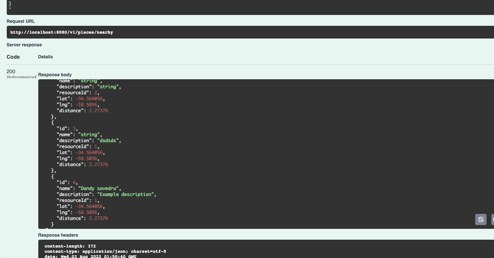

# Geolocation API :turtle:

Simple Geolocation API with postgres.

features:
 - CRUD places
 - Find nearby places based on a user's location and distance.

### Enviroments

- GIN_MODE=(`debug` | `release`). Set `release` if you're in production.
- PORT
- POSTGRE_HOST
- POSTGRE_USER
- POSTGRE_PASS
- POSTGRE_DB
- POSTGRE_PORT

### Start app in dev

1) Start pg service: `docker-compose up -d geo-pg`
2) Create table: `docker exec -it geo-pg psql -U postgres -W your-database-here`. If the database does not exist, then you need to create it.
3) Copy the content of `migration.sql` in terminal.
4) Start api: `docker-compose up -d geo-api`
5) Swagger url: `http://localhost:8080/swagger/index.html`

### Commands
  - Build app geo-api: `make build`

### Documentation
 - [postgresql-geo-queries-made-easy](https://postindustria.com/postgresql-geo-queries-made-easy/)

### Main dependencies

- [Gin-gonic](https://github.com/gin-gonic/gin)
- [Field validator](https://pkg.go.dev/github.com/go-playground/validator/v10#readme-usage-and-documentation)
- [Gin swagger](https://github.com/swaggo/gin-swagger)
- [swag](https://github.com/swaggo/swag)
